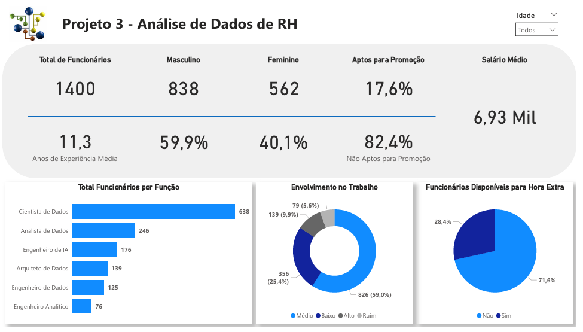

# Projeto 3 - Análise de Dados de RH
Projeto do curso: "Microsoft Power BI Para Business Intelligence e Data Science", por [Data Science Academy](www.datascienceacademy.com.br). 

## Entendimento do Negócio
A área de Recursos Humanos (RH) tem como função principal gerenciar e administrar as atividades relacionadas ao pessoal de uma empresa, a fim de promover o desenvolvimento e a satisfação dos funcionáriose, consequentemente, contribuir para o sucesso da organização.  

Algumas das responsabilidades comuns da área de Recursos Humanos incluem:

- Recrutamento e seleção: publicar vagas, conduzir entrevistas, aplicar testes e avaliar candidatos para preencher vagas na empresa.
- Treinamento  e  desenvolvimento:  identificar  as  necessidades  de  treinamento  dos funcionários,  planejar  e  implementar  programas  de  treinamento  para  melhorar habilidades e desenvolvimento profissional.
- Remuneração   e   benefícios:  determinar  salários  competitivos e administrar programas de benefícios, como seguro saúde e férias remuneradas.
- Gestão   de   conflitos:  ajudar  a  resolver  disputas  entre  funcionários  ou  entre funcionários  e gestores,  a  fim  de  manter  um  ambiente  de  trabalho  saudável  e produtivo.
- Políticas e práticas de RH: desenvolver e implementar políticas e práticas de RH, como políticas de igualdade de oportunidades, diversidade e inclusão, e garantir que sejam aplicadas de maneira consistente.
- Avaliação  do  desempenho: avaliar regularmente o desempenho dos funcionários, fornecer  feedback  e  ajudar  a  definir  metas  e  objetivos  de  desenvolvimento profissional.

Esses são apenas alguns exemplos das atribuições da área de RH de uma empresa que pode ser bastante beneficiada pelaanálisede dados.

## Principais KPIs da Área de Recursos Humanos
Os KPIs (Key Performance Indicators, ou Indicadores Chave de Desempenho) são medidas quantitativas que ajudam a avaliar o sucesso de uma área ou função em umaempresa. Na área de Recursos Humanos, alguns dos principais KPIs incluem:  

- Taxa  de  rotatividade:  mede  a  frequência  com  que  os  funcionários  estão  deixando  a empresa,  o  que  pode  indicar  problemas  com  o  ambiente  de  trabalho,  remuneração  ou oportunidades de desenvolvimento.
- Satisfação do funcionário: mede o grau de satisfação dos funcionários com relação ao trabalho, remuneração, ambiente de trabalho e oportunidades de desenvolvimento.
- Tempo médio para preenchimento de vagas: mede o tempo necessário para preencher uma vaga aberta, o que pode indicar a eficiência do processo de recrutamento e seleção.
- Custo  de  contratação  por  funcionário:  mede  o  custo  total  de  contratar  um  novo funcionário, incluindo gastos com anúncios de vagas, entrevistas, testes e treinamento.
- Participação  em  treinamentos:  mede  o  número  de  funcionários  que  participam  de programas de treinamento e desenvolvimento, o que pode indicar o interesse dos funcionários em melhorar suas habilidades e desenvolver suas carreiras.
- Avaliação de desempenho: mede a avaliação do funcionário em um ciclo de trabalho, normalmente 6 meses ou 12 meses.
- Nível de absenteísmo: mede a frequência com que os funcionários faltam ao trabalho, o que pode indicar problemas com o ambiente de trabalho ou saúde dos funcionários.
- Nível  de  engajamento:  escala  que  define  quão  engajados  os  funcionários estão, normalmente medida  com  base  nonível  de  absenteísmo, pontualidade,  avaliação  de desempenho,etc...

Esses são apenas alguns exemplos de KPIs que podem ser utilizados na área de Recursos Humanos.

## Desenvolvimento do Projeto

### Entregas para o Negócio
A solução desenvolvida irá responder às seguintes perguntas de negócio:  

1. Qual o total de funcionários atualmente na empresa?
2. Qual otempo médio de experiência dos funcionários (em anos)?
3. Qual o total e percentual de funcionários do gênero masculino e feminino?
4. Qual a média salarial mensal?
5. Qual o total de funcionários por função?
6. Qual o percentual defuncionários disponíveis para fazer hora extra
7. Qual onível de envolvimento dos funcionários no trabalhoconsiderando 4 categorias: Ruim, Baixo, Médio e Alto?
8. Este item não deve estar no Dashboard,mas precisa ser calculado: Qual o total e o percentual de funcionários que devem receber promoção? Considere a coluna “Anos Desde a última Promoção”com a seguinte regra: Se o funcionário tiver 5 anos ou mais desde  a última  promoção,  deve ter  a  promoção  considerada.  Caso  contrário, a promoção não deve ser considerada agora.

### Sobre o Dataset
O dataset contém informações de Recursos Humanos, com dados individuais de colaboradores e suas características de trabalho. Ele possui 1.400 registros e 21 colunas, cobrindo aspectos demográficos, função, desempenho e histórico na empresa.  

As principais informações presentes são:
- Dados pessoais: idade, gênero, estado civil.
- Informações profissionais: departamento, função, anos de experiência, anos na empresa e anos com o gerente atual.
- Condições de trabalho: necessidade de viagem, possibilidade de horas extras e valor de diárias.
- Indicadores de performance: envolvimento com o trabalho, satisfação, avaliação de desempenho e percentual de aumento salarial.
- Histórico: número de treinamentos, promoções, e empresas anteriores.

### Dicionário de Dados
| Coluna                                    | Descrição                                    | Tipo     |
| ----------------------------------------- | -------------------------------------------- | -------- |
| **Id_Funcionario**                        | Identificador único do colaborador           | Inteiro  |
| **Idade**                                 | Idade do colaborador                         | Inteiro  |
| **Genero**                                | Gênero do colaborador (Masculino/Feminino)   | Texto    |
| **Estado Civil**                          | Estado civil do colaborador                  | Texto    |
| **Departamento**                          | Departamento onde trabalha                   | Texto    |
| **Funcao**                                | Cargo/Função ocupada na empresa              | Texto    |
| **Viagem**                                | Frequência de viagens a trabalho             | Texto    |
| **Valor Diaria**                          | Valor pago por diária de viagem              | Numérico |
| **Indice_Envolvimento_Trabalho**          | Grau de envolvimento com o trabalho (1 a 4)  | Inteiro  |
| **Nivel_Satisfacao_Trabalho**             | Grau de satisfação com o trabalho (1 a 4)    | Inteiro  |
| **Avaliacao_Desempenho**                  | Índice da última avaliação de desempenho     | Inteiro  |
| **Numero_Empresas_Anterior**              | Quantidade de empresas onde trabalhou antes  | Inteiro  |
| **Saldo_Folga**                           | Saldo de folgas disponíveis                  | Inteiro  |
| **Necessita_Horas_Extras**                | Indica necessidade de horas extras (Sim/Não) | Texto    |
| **Percentual_Aumento_Salarial**           | Percentual de aumento salarial recente       | Numérico |
| **Tempo_Decorrido_Desde_Ultima_Promocao** | Anos desde a última promoção                 | Inteiro  |
| **Numero_Treinamentos_Ano_Anterior**      | Treinamentos realizados no último ano        | Inteiro  |
| **Anos_na_Empresa**                       | Tempo total na empresa (anos)                | Inteiro  |
| **Anos_Funcao_Atual**                     | Tempo na função atual (anos)                 | Inteiro  |
| **Anos_Desde_Ultima_Promocao**            | Tempo desde a última promoção (anos)         | Inteiro  |
| **Anos_com_Gerente_Atual**                | Tempo trabalhando com o gerente atual (anos) | Inteiro  |

### Dataviz do Projeto
Segue solução proposta, com as respostas solicitadas para a área de negócio.

